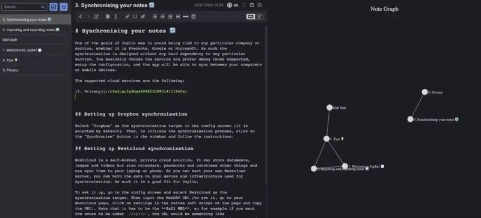

# Link Graph UI for Joplin

This Joplin plugin provides a UI for viewing all links between Joplin notes.

## Basic Features

* View all links between notes in a graph view - the graph automatically refreshes when you change a note
* Zoom and pan on the graph to see links between your notes (and hopefully spark some ideas)
* Click on Notes in the graph to instantly navigate to the note

Screenshot:

