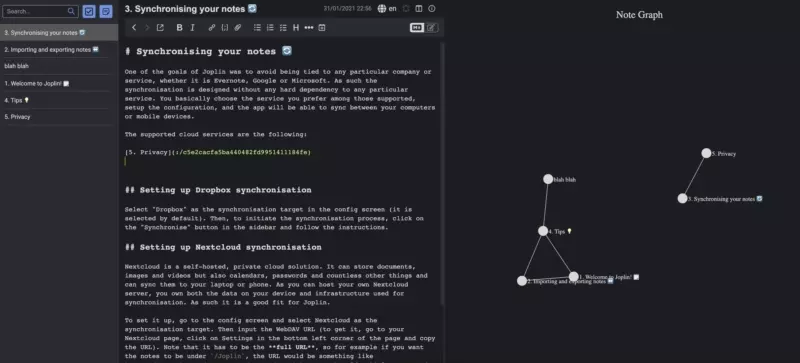

# Link Graph UI for Joplin

This Joplin plugin provides a UI for viewing all links between Joplin notes.

**Note:** Requires Joplin 2.13+

Combine this plugin with the [Joplin Backlinks](https://discourse.joplinapp.org/t/automatic-backlinks-with-manual-insert-option/13632) and [Quicklinks](https://discourse.joplinapp.org/t/quick-links-plugin/14214) for Zettelkasten-type functionality!

## Basic Features

* View all links between notes in a graph view - the graph automatically refreshes when you change a note
* Zoom and pan on the graph to see links between your notes (and hopefully spark some ideas)
* Click on Notes in the graph to instantly navigate to the note

Screenshot:

## Development

1. Check out the Git repository
1. `cd` into the repository and run `npm install` to install dependencies.
1. Run `npm run dist` to build the plugin. Joplin loads the plugin from `dist/`.
1. Start Joplin in [dev mode](https://joplinapp.org/api/references/development_mode/),
   which uses a separate profile so your notes are not at risk. Help > Copy dev
   mode command to clipboard gives you the command for your install; it is the
   Joplin executable with `--env dev`.
1. In that Joplin, open Tools > Options > Plugins > Advanced and set
   **Development plugins** to the path of this repository, not the `dist/`
   directory.
1. Restart Joplin. Settings > Plugins lists Link Graph UI once it loads.

After changing the source, run `npm run dist` again and restart Joplin.

Run the tests with `npm test`, or `npm run test:watch` while working.
