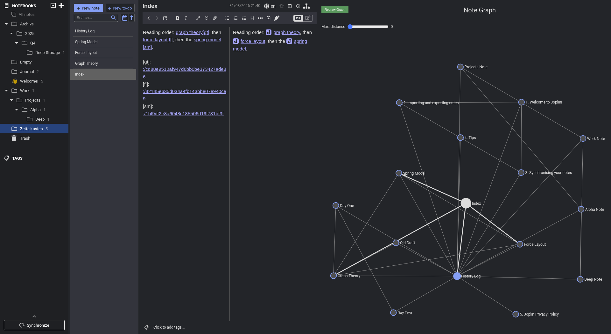

# Link Graph UI 1.6.0

Every pull request merged since [v1.5.0](https://github.com/treymo/joplin-link-graph/releases/tag/v1.5.0) of 15 April 2022.

## New features

### The notebook filter takes notebook identifiers

Each entry in **Notebooks names to filter** can be a notebook name or a notebook identifier, for example `Journal, 71d97a738b714d588d6b5629bf7b662e`. ([#84](https://github.com/treymo/joplin-link-graph/pull/84))

### Backlinks from a chosen note can be ignored

**Note titles to exclude from backlinks** skips the backlinks from the notes it lists. A history log linking everywhere stops pulling the whole vault into the graph. ([#98](https://github.com/treymo/joplin-link-graph/pull/98), closes [#85](https://github.com/treymo/joplin-link-graph/issues/85))

Two degrees of separation out from `Graph Theory`, with backlinks included.

| Exclusion list empty | `History Log` excluded |
| --- | --- |
|  |  |

### Reference-style link definitions count as links

A destination declared at the end of the body as `[label]: :/noteid` draws an edge. ([#97](https://github.com/treymo/joplin-link-graph/pull/97), closes [#67](https://github.com/treymo/joplin-link-graph/issues/67))

## Fixes

- Trim the names in **Notebooks names to filter**, so `Work, Personal` matches `Personal`. An empty include filter counts as no filter. ([#94](https://github.com/treymo/joplin-link-graph/pull/94), closes [#49](https://github.com/treymo/joplin-link-graph/issues/49))
- Filter notebooks nested more than two levels deep. ([#95](https://github.com/treymo/joplin-link-graph/pull/95))
- Increase the contrast of edges touching neither the selected note nor its neighbours. Edges touching the selected note keep their brighter colour. ([#91](https://github.com/treymo/joplin-link-graph/pull/91))
- Redraw the graph when the selected note gains or loses a link. ([#90](https://github.com/treymo/joplin-link-graph/pull/90), [#100](https://github.com/treymo/joplin-link-graph/pull/100))
- Draw the graph while a notebook holding no notes is open, rather than leaving the panel blank. ([#93](https://github.com/treymo/joplin-link-graph/pull/93))

| `Journal, Archive` excluded by name | A notebook holding no notes open |
| --- | --- |
|  |  |

## Performance

- Skip graph collection while the panel is hidden, and replay the skipped update when the panel is shown. ([#99](https://github.com/treymo/joplin-link-graph/pull/99), part of [#39](https://github.com/treymo/joplin-link-graph/issues/39))

## Under the hood

- Vitest covers the note, notebook, filter, graph, and settings helpers, and runs on every push and pull request. ([#96](https://github.com/treymo/joplin-link-graph/pull/96), [#88](https://github.com/treymo/joplin-link-graph/pull/88))
- Drop the `@joplin/lib` and `deep-equal` dependencies. ([#86](https://github.com/treymo/joplin-link-graph/pull/86))
- Split note collection, notebook resolution, filtering, and graph flattening into `src/data/` modules. ([#74](https://github.com/treymo/joplin-link-graph/pull/74), [#76](https://github.com/treymo/joplin-link-graph/pull/76), [#89](https://github.com/treymo/joplin-link-graph/pull/89), [#92](https://github.com/treymo/joplin-link-graph/pull/92))
- Match the plugin API version to Joplin 2.13 and later. ([#82](https://github.com/treymo/joplin-link-graph/pull/82))
