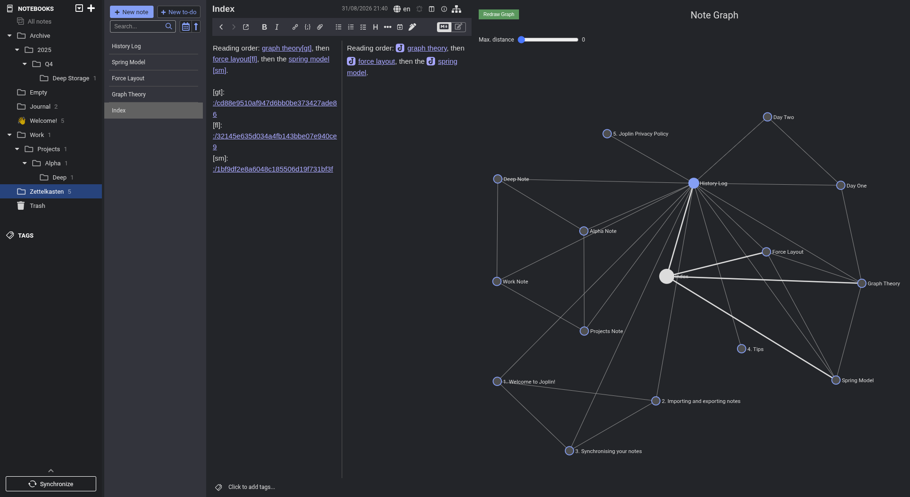
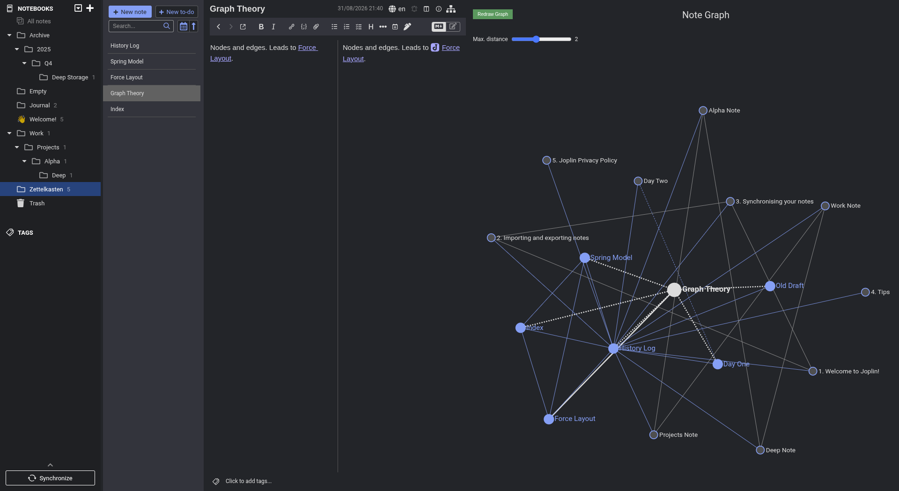
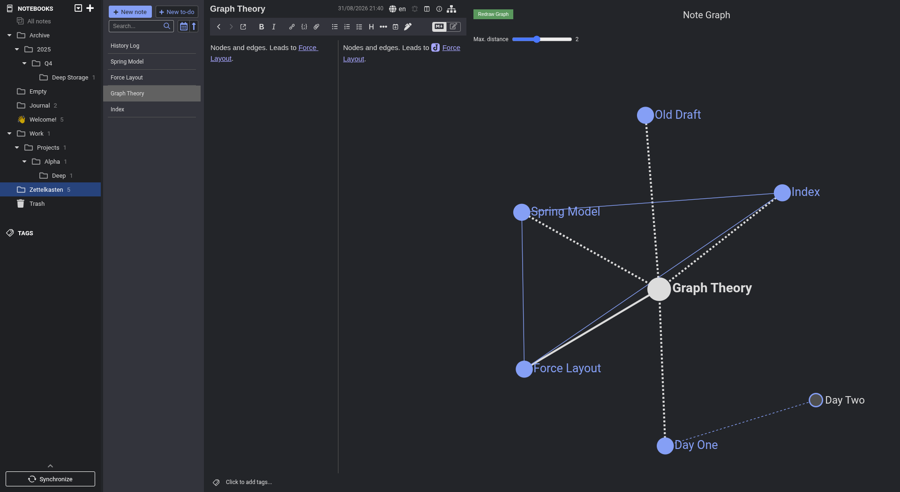
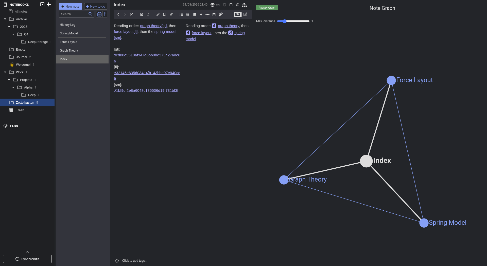
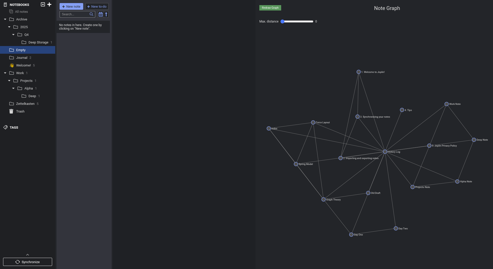
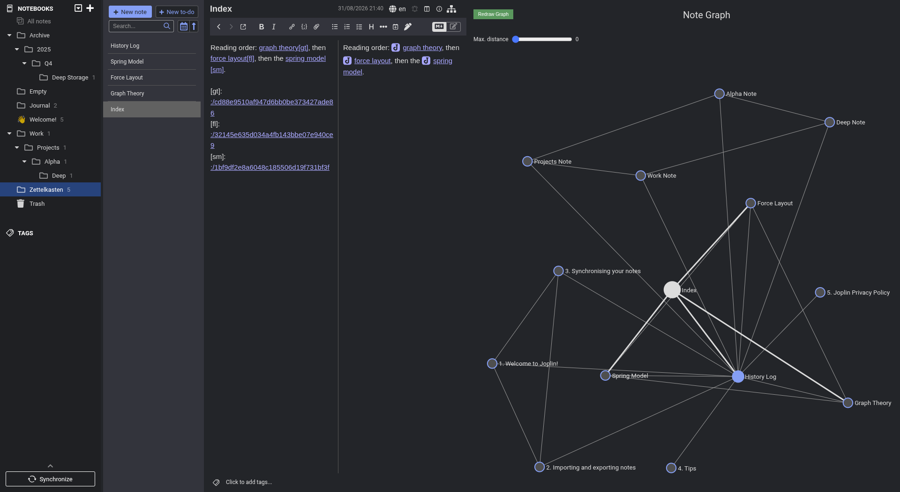

# Link Graph UI 1.6.0

These notes cover every pull request merged since [v1.5.0](https://github.com/treymo/joplin-link-graph/releases/tag/v1.5.0) of 15 April 2022. The screenshots show Joplin 3.6.16 in development mode.

## New features

### The notebook filter takes notebook identifiers

**Notebooks names to filter** accepts a comma separated list. Each entry can be a notebook name, a notebook identifier (ID), or both kinds together. The plugin matches each entry against notebook IDs first. When no notebook carries the ID, the plugin matches the entry against notebook titles. A filter written before this release keeps working. ([#84](https://github.com/treymo/joplin-link-graph/pull/84))

The filter below holds the ID of the `Archive` notebook. `Old Draft` sits three notebooks below `Archive`, and the graph drops it.

### Backlinks from a chosen note can be ignored

A history log links to the whole vault. Turning backlinks on therefore pulled the whole vault into the graph. **Note titles to exclude from backlinks** takes a comma separated list of note titles. The plugin skips the backlinks from those notes. An excluded note still appears when a note already in the graph links to it. Whole-graph mode ignores the setting. ([#98](https://github.com/treymo/joplin-link-graph/pull/98), closes [#85](https://github.com/treymo/joplin-link-graph/issues/85))

Both graphs below reach two degrees of separation out from `Graph Theory` with backlinks included. The left graph reaches all 17 notes through `History Log`. The right graph carries `History Log` on the exclusion list and holds the 7 notes within two links.

| Exclusion list empty | `History Log` excluded |
| --- | --- |
|  |  |

### Reference-style link definitions count as links

Some notes collect their link destinations at the end of the body. CommonMark calls the form a reference definition and writes it as `[label]: :/noteid`. Such a note drew no edges. The plugin now collects every reference definition pointing at a Joplin note. A definition no label in the body uses counts as well. A definition placing its destination on the line after the colon stays unmatched. ([#97](https://github.com/treymo/joplin-link-graph/pull/97), closes [#67](https://github.com/treymo/joplin-link-graph/issues/67))

## Fixes

### Opening a notebook holding no notes

Joplin reports no selected note when a notebook holds none. Three places in the plugin read the missing note and threw. The panel stayed blank until another event rebuilt it. The plugin now draws every note and focuses none. ([#93](https://github.com/treymo/joplin-link-graph/pull/93))

### Notebook names in the filter setting

The plugin trims the names in **Notebooks names to filter**. The list `Work, Personal` therefore matches a notebook named `Personal`, not only the first name in the list. An empty filter in include mode counts as no filter rather than emptying the graph. ([#94](https://github.com/treymo/joplin-link-graph/pull/94), closes [#49](https://github.com/treymo/joplin-link-graph/issues/49))

The graph below excludes `Journal, Archive` with **Filter child notebooks** enabled. The two `Journal` notes and `Old Draft` drop out, and the other 14 notes remain.

### Notebooks nested more than two levels deep

**Filter child notebooks** reached a filtered notebook's children and grandchildren, then stopped. The plugin now collects every generation below the filtered notebook. ([#95](https://github.com/treymo/joplin-link-graph/pull/95))

### Edges away from the selected note

An edge touching neither the selected note nor its neighbours carried one of Joplin's background colours. That colour gives a contrast ratio of 1.97:1 against the panel. Selecting a note with no links therefore turned the graph into a scatter of unconnected dots. Those edges now carry the colour the stylesheet already gives de-emphasised labels, a ratio of 5.74:1. Edges touching the selected note keep their brighter colour. ([#91](https://github.com/treymo/joplin-link-graph/pull/91))

### The graph follows link edits

Adding or removing a link in the selected note left the old edges on screen. The graph waited for an unrelated event to refresh. Editing the selected note's links now collects the graph again and redraws it. The plugin records the set of links to compare against when a note is selected and at startup. The first edit after a note switch therefore compares against the correct note. An edit producing an identical graph, such as a link to a note the filter removed, skips the redraw. ([#90](https://github.com/treymo/joplin-link-graph/pull/90), [#100](https://github.com/treymo/joplin-link-graph/pull/100))

## Performance

### No graph work while the panel is hidden

Switching notes, completing a sync, or changing a setting collected the whole note graph, even with the panel closed. Two paths now check whether the panel is visible. The first is the workspace event path. The second is the `update` message a webview sends once per script load. The plugin records an update skipped while the panel is hidden. Showing the panel replays that update, which also fills the graph on first open. ([#99](https://github.com/treymo/joplin-link-graph/pull/99), part of [#39](https://github.com/treymo/joplin-link-graph/issues/39))

## Under the hood

- Vitest covers the link extraction, notebook, filter, graph, and settings helpers. The suite runs on every push and pull request. ([#96](https://github.com/treymo/joplin-link-graph/pull/96), [#88](https://github.com/treymo/joplin-link-graph/pull/88))
- The plugin no longer depends on `@joplin/lib` or `deep-equal`. ([#86](https://github.com/treymo/joplin-link-graph/pull/86))
- Note collection, notebook resolution, filtering, and graph flattening live in `src/data/` as separate modules. ([#74](https://github.com/treymo/joplin-link-graph/pull/74), [#76](https://github.com/treymo/joplin-link-graph/pull/76), [#89](https://github.com/treymo/joplin-link-graph/pull/89), [#92](https://github.com/treymo/joplin-link-graph/pull/92))
- The plugin API version matches Joplin 2.13 and later. ([#82](https://github.com/treymo/joplin-link-graph/pull/82))
